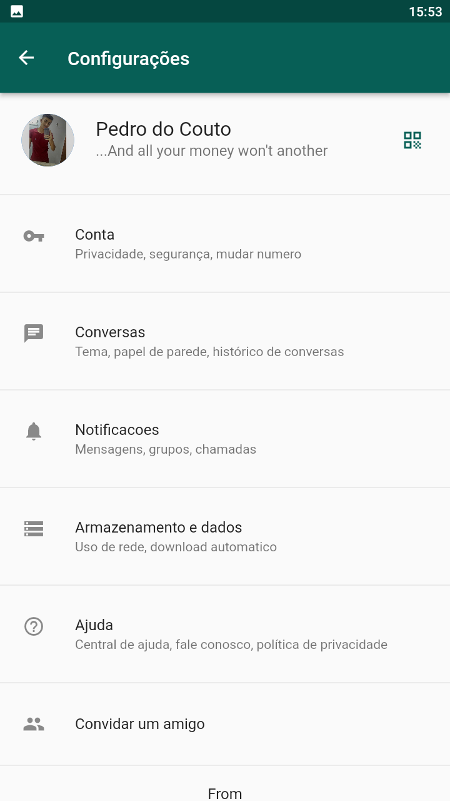

# WhatsApp em Flutter
   

## Sobre este projeto
  Este projeto foi feito apenas para fins de estudo do framework [Flutter](https://flutter.dev/?gclid=CjwKCAiA55mPBhBOEiwANmzoQnfyu40DCk6NgrCn0W5iQbmhKHjUQqPih9NhQS1yc2yx1zLiR0aGIRoCGOIQAvD_BwE&gclsrc=aw.ds).
 
